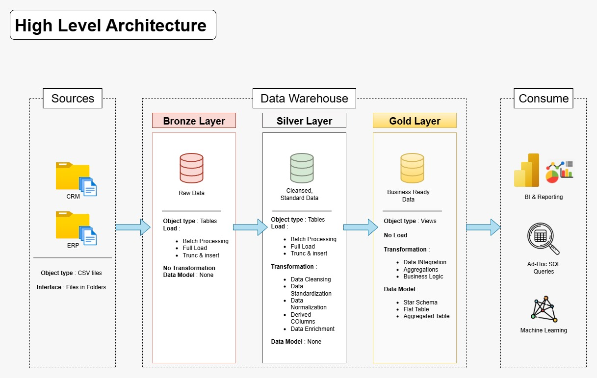

# Data Warehouse and Analytics Project

Welcome to the Data Warehouse and Analytics Project repository! 
This project demonstrates a comprehensive data warehousing and analytics solution, from building a data warehouse to generating actionable insights. Designed as a portfolio project, it highlights industry best practices in data engineering and analytics.

----
# 📊 Data Warehouse and Analytics Project

Welcome to the **Data Warehouse and Analytics Project** repository! 🚀  
This project demonstrates a comprehensive **data warehousing and analytics solution**, from building a data warehouse to generating actionable insights.  

---

## 🏗️ Data Architecture  

This project follows the **Medallion Architecture** (Bronze, Silver, Gold layers):  

- **Bronze Layer**: Stores **raw data** as-is from the source systems. Data is ingested from **CSV files** into a **SQL Server database**.  
- **Silver Layer**: Performs **data cleansing, standardization, and normalization** to prepare data for analytics.  
- **Gold Layer**: Contains **business-ready data**, modeled into a **star schema** optimized for reporting and analytics.  

---

## 📖 Project Overview  

This project involves:  

- **Data Architecture**: Designing a modern data warehouse using the **Medallion architecture**. 
- **ETL Pipelines**: Extracting, transforming, and loading data from source systems into the warehouse.  
- **Data Modeling**: Developing **fact** and **dimension** tables for analytical queries.  
- **Analytics & Reporting**: Creating **SQL-based reports** and dashboards for actionable insights.  

---

## 🎯 Skills Demonstrated  

- **SQL Development**  
- **Data Architecture**  
- **Data Engineering**  
- **ETL Pipeline Development**  
- **Data Modeling**  
- **Data Analytics**  

----
### Building Data Warehouse (Data Engineering)

#### Objective
Develop a modern data warehouse using SQL Server to consolidate sales data, enabling analytical reporting and informed decision-making.

#### Specifications
- **Data Sources**: Import data from two source systems (ERP and CRM) provided as CSV files.
- **Data Quality**: Cleanse and resolve data quality issues prior to analysis.
- **Integration**: Combine both sources into a single, user-friendly data model designed for analytical queries.
- **Scope**: Focus on the latest dataset only; historization of data is not required.
- **Documentation**: Provide clear documentation of the data model to support both business stakeholders and analytics teams.

---

## 🛡️ License

This project is licensed under the [MIT License](LICENSE). You are free to use, modify, and share this project with proper attribution.

